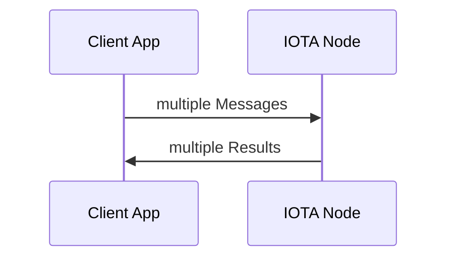
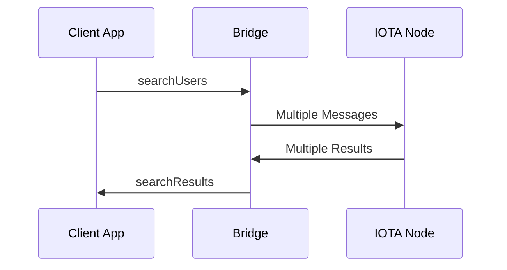

# LibertyNet

A censorship resistent web application development platform built on the IOTA DAG.

Note: This is an early release.  Hopefully changes will be kept to a minimum.

#### Provides

* A user system for signup, login and signature verfication
* An immutable database layer to provide basic CRU (no D) functionality for objects
* Indexes are possible to relate data together

#### How does it work

Users setup an IOTA node locally or remotely that belongs to them.  LibertyNet provides a simple API and components that can be used to store and retrieve data on the IOTA DAG which is replicated to other nodes which makes your application censorship proof.  If a node is shut down, the data is replicated to many different nodes.

Any data written is signed by the user.  There is no central gatekeeper for adding data so LibertyNet handles checking signatures on the client side.  This is a change in the normal paradigm where security is handled centrally.  In this case, the client can decide what data is valid, and what data is not.  Control of the data is local to the user instead of central.  The user can choose what they want to see.

#### Quickstart

**Setup a libertynet node**

* Install docker and docker-compose

* `git clone https://github.com/scottburch/libertynet.git`

* `cd libertynet/node`

* `docker-compose up`

* Open a browser and go to `http://localhost:8081` wait for 'sync' and 'health to turn green'

  

**Install the demo application**

* Make sure that node is installed on your system

* `cd examples/web-demo`

* `yarn` or `nom install`

* `yarn build` or `npm run build`

* Open the newly created file in examples/web-demo/lib/index.html in a web browser


#### Basic Architecture

There are two basic possible architectures, with a bridge and without.  If your IOTA node is local to the clients, then the bridge is not necessary.  However, if your IOTA node is remote from your client app, you must use a bridge for performance.  Choosing whether or not to use a bridge in the client code is easy.  All of the communication functions use either of these two clients seamlessly.

```javascript
// With a bridge - use the address of the bridge and the network you wish to use
newRemoteDbConnector('http://localhost:3000/json-rpc', Network.DEVNET)

// Without a bridge - just the network you wish to use
newLocalDbConnector(Network.DEVNET)

```







#### Core API

The core api consists of a group of functions that serve as the basic building blocks of a system.  It consists mainly of user management and storing/retrieving signed objects.  

Any data that is stored must be stored as a signed object that is signed by a user.  There is a type generator that allows you to add any data type and wrap it as a signed object so it can be stored and retrieved by the platform.  By having users sign the data they are storing, a client that is retrieving data can be assured that the data has not been tampered with and does indeed belong to the user defined in the data.

### newClient(options: ClientOptions)

**clientOptions**

| Option    | Type        | Notes                                                |
| --------- | ----------- | ---------------------------------------------------- |
| username  | string      | The user name                                        |
| password  | string      | The users password                                   |
| connector | DbConnector | Either the local or remote connector described above |

**Returns**

A client object to be used as an argment for the other functions


### login(client: Client) : Promise\<boolean\>

Logs in using the client created with newClient()

**Returns**

true or throws an error


### signup(client: Client, profile: UserProfile) : Promise\<unknown\>

| Option  | Type        | Notes                                  |
| ------- | ----------- | -------------------------------------- |
| client  | Client      | The client created with newClient()    |
| profile | UserProfile | {displayName: string, profile: string} |

**UserProfile**

| Option      | Type   | Notes                             |
| ----------- | ------ | --------------------------------- |
| displayName | string | The display name for the username |
| profile     | string | A public description              |


### doesUsernameExist(client: Client, username: ?string) : Promise\<boolean\>

| Option   | Type              | Notes                                                        |
| -------- | ----------------- | ------------------------------------------------------------ |
| client   | Client            | The client created with newClient()                          |
| username | string (optional) | The username to check, if none is provided will use the username in client |


### readUser(client: Client, username: ?string) : Promise\<User\>

| Option   | Type              | Notes                                                        |
| -------- | ----------------- | ------------------------------------------------------------ |
| client   | Client            | The client created with newClient()                          |
| username | String (optional) | If the username is omitted, the username from client will be used |

**Returns**

A user object


### updateProfile(client: Client, profile: UserProfile) : Promise\<unknown\>

| Option      | Type   | Notes                             |
| ----------- | ------ | --------------------------------- |
| displayName | string | The display name for the username |
| profile     | string | A public description              |


### searchUsers(client: Client, prefix: string): Promise<User[]>

| Option | Type   | Notes                                        |
| ------ | ------ | -------------------------------------------- |
| client | Client | The client created with newClient()          |
| prefix | string | The first part of the username to search for |

**Returns**

A list of users


### storeObject(params: StoreObjectParams) : Promise\<NodeId\>

